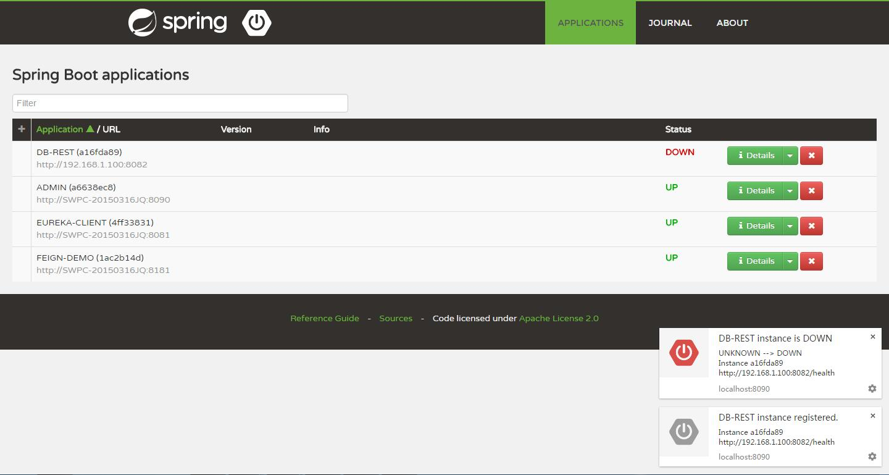
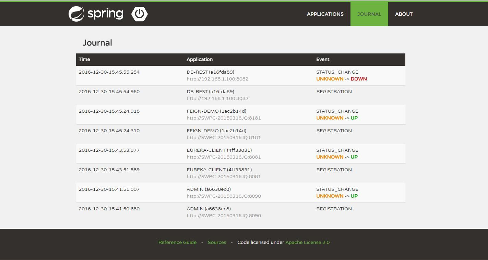

# admin-server  
本模块简单演示了[Spring Boot Admin](http://codecentric.github.io/spring-boot-admin/1.5.0)。  
本模块已将admin server注册为eureka客户端，所以不需要再增加admin client。  
Spinrg Boot Admin可用于管理和监控基于Spring Boot的应用。

|url|desc|  
|:---|:---|   
|http://localhost:8090|spring boot admin ui|   

## 启用Spring Boot Admin  
* 引入Maven依赖  

``` maven
<properties>
    <spring.boot.admin.server>1.5.0</spring.boot.admin.server>
    ...
</properties>

<!-- spring-boot-admin -->
<dependency>
    <groupId>de.codecentric</groupId>
    <artifactId>spring-boot-admin-server</artifactId>
    <version>${spring.boot.admin.server}</version>
</dependency>
<dependency>
    <groupId>de.codecentric</groupId>
    <artifactId>spring-boot-admin-server-ui</artifactId>
    <version>${spring.boot.admin.server}</version>
</dependency>

<!-- eureka 客户端 -->
<dependency>
    <groupId>org.springframework.cloud</groupId>
    <artifactId>spring-cloud-starter-eureka</artifactId>
</dependency>
```

* 配置应用\端口等  

_以下是bootstrap.yml中相关配置_  

``` yml
spring:
  application:
    name: admin 
server:
  port: 8090

eureka:
  instance:
    leaseRenewalIntervalInSeconds: 10
    leaseExpirationDurationInSeconds: 30
  client:
    serviceUrl:
      defaultZone: http://localhost:8761/eureka/
```


* 启用AdminServer  

_增加@EnableAdminServer，启用Spring Boot Admin_  
_增加@EnableDiscoveryClient，启用服务注册与发现_  

``` java
@EnableDiscoveryClient
@EnableAdminServer
@SpringBootApplication
public class SpringBootAdminServerApplication {

    public static void main(String[] args) {
        SpringApplication.run(SpringBootAdminServerApplication.class, args);
    }
}
```

## 运行截图  

* Applications  

   

* Journal  

   