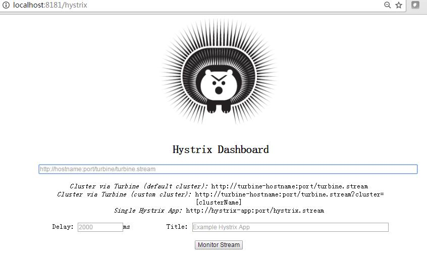
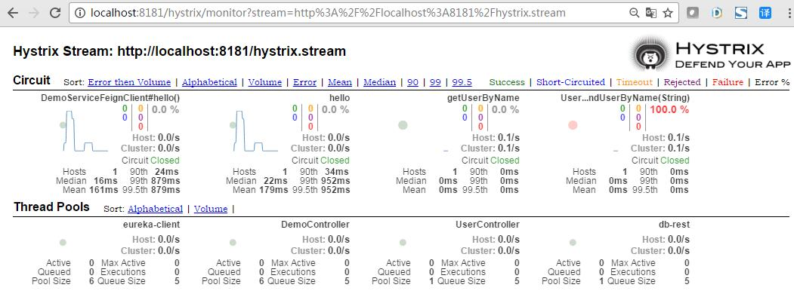
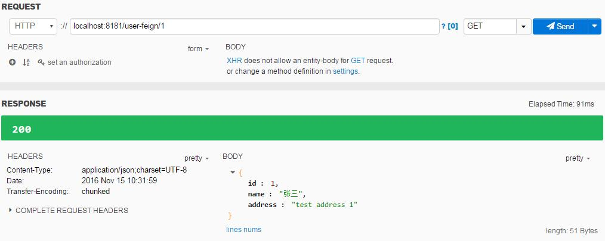
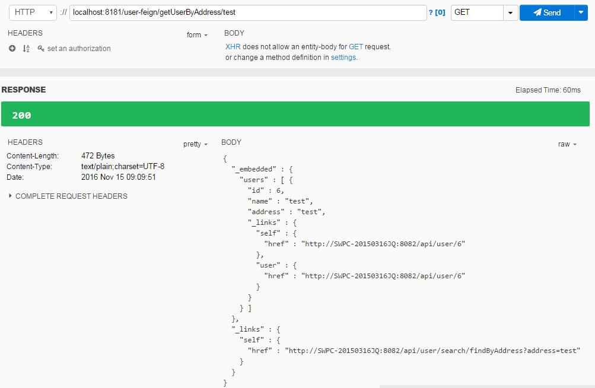
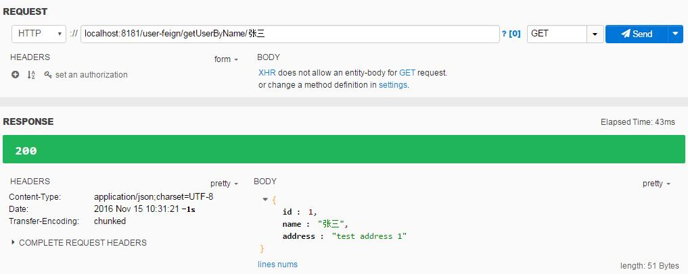
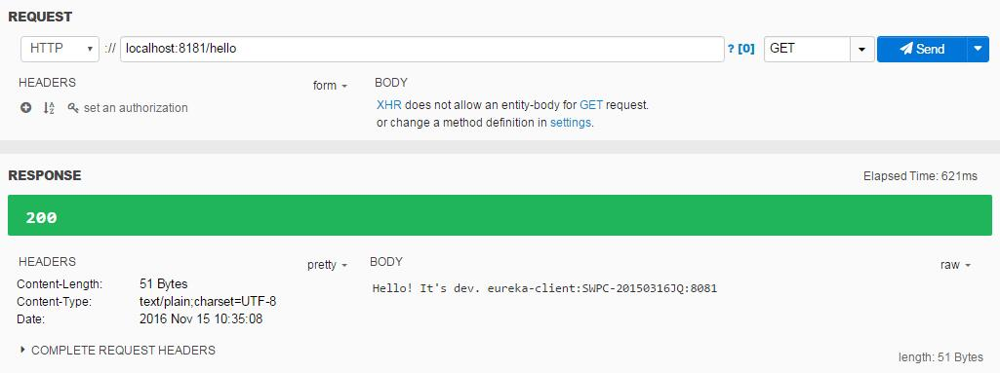
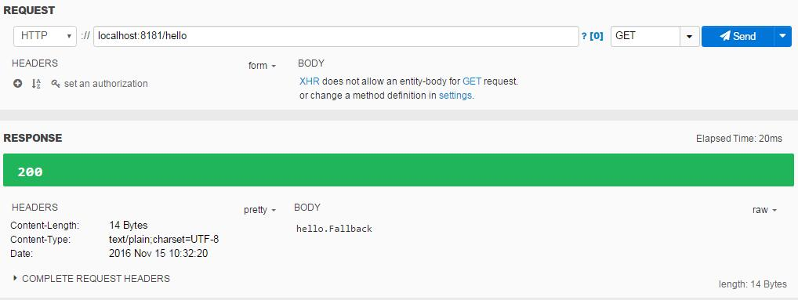

# feign-demo
本模块主要演示集成了Feign、Hystrix的Eureka客户端。  

_FeignClient方式调用接口_  

|url|desc|  
|:---|:---|  
|http://localhost:8181/hello|输出hello信息 [eureka-client]|  
|http://localhost:8181/user-feign/1|根据ID获取User [db-rest]|  
|http://localhost:8181/user-feign/getUserByName/张三|根据name获取User [db-rest]|  
|http://localhost:8181/user-feign/getUserByAddress/test|根据地址获取User [db-rest]|  


_RestTemplate方式调用接口_   

|url|desc|  
|:---|:---|  
|http://localhost:8181/user-rest/1|根据ID获取User [db-rest]|  


_Hystrix Dashboard监控_  

|url|desc|  
|:---|:---|    
|http://localhost:8181/hystrix|查看仪表盘|  
|http://localhost:8181/hystrix.stream|在仪表盘中增加监控|  

## 配置FeignClient

* 引入Maven依赖  

``` maven
<dependency>
	<groupId>org.springframework.cloud</groupId>
	<artifactId>spring-cloud-starter-feign</artifactId>
</dependency>
```

* 启用FeignClient  

_spring boot启动类增加@EnableFeignClients注解，使其自动扫描@FeignClient_  

``` java
@EnableFeignClients
@EnableDiscoveryClient
@SpringBootApplication
public class EurekaClientFeignApplication {
	public static void main(String[] args) {
		SpringApplication.run(EurekaClientFeignApplication.class, args);
	}
}
```

_定义需要通过FeignClient访问的接口列表，如下：_  

``` java
// value为服务名，对应spring.application.name。注意：此服务名必须已注册进Eureka服务中心
@FeignClient(value = "db-rest", fallback = UserServiceFeignClientFallback.class)
public interface UserServiceFeignClient extends UserService {

}

// 定义FeignClient接口访问列表。注意：地址一定要正确
// 测试中发现：
//  spring data rest实现的方法，如带有参数；接口url需要以/method?param={param}的方式定义；
//  而controller层实现的方法，接口url则可以直接通过/method/{param}的方式定义
public interface UserService {
	@RequestMapping(value = "/api/user/{id}", method = RequestMethod.GET, produces = MediaType.APPLICATION_JSON_VALUE, consumes = MediaType.APPLICATION_JSON_VALUE)
    User getUser(@PathVariable("id") int id);
	
	@RequestMapping(value = "/api/user/search/findByName?name={name}", method = RequestMethod.GET, produces = MediaType.APPLICATION_JSON_VALUE, consumes = MediaType.APPLICATION_JSON_VALUE)
	User findUserByName(@PathVariable("name") String name);
	
	@RequestMapping(value = "/api/user/search/findByAddress?address={address}", method = RequestMethod.GET)
	String findUserByAddress(@PathVariable("address") String address);
}

// 定义各接口对应的fallback方法
@Component
public class UserServiceFeignClientFallback implements UserServiceFeignClient {

	@Override
	public User getUser(int id) {
		return new User("getUser.Fallback", "feignClient return");
	}
	
	@Override
	public User findUserByName(String name) {
		return new User("findUserByName.Fallback", "feignClient return");
	}

	@Override
	public String findUserByAddress(String address) {
		return "fallback";
	}
}
```

_以下是RestTemplate调用方式：_

``` java
public User getUser(int id) {
	User user = restTemplate.exchange( "http://db-rest/api/user/{id}", HttpMethod.GET, null, new ParameterizedTypeReference<User>() { }, id).getBody();
	return user; 
}
```

## 配置Hystrix

* 引入Maven依赖  

``` maven
<dependency>
	<groupId>org.springframework.cloud</groupId>
	<artifactId>spring-cloud-starter-hystrix</artifactId>
</dependency>
```

* 增加Hystrix配置  

_以下仅配置了启用超时及超时时间_  

``` java
@HystrixCommand(commandProperties = {
		@HystrixProperty(name = "execution.isolation.thread.timeoutInMilliseconds", value = "1000"),
		@HystrixProperty(name = "execution.timeout.enabled", value = "false") })
@RequestMapping(value = "/user-feign/{id}", method = RequestMethod.GET)
public User getUser(@PathVariable int id) {
	return userServiceFeignClient.getUser(id);
}
```

## 配置Hystrix Dashboard
* 引入Maven依赖  

``` maven  
<dependency>
	<groupId>org.springframework.boot</groupId>
	<artifactId>spring-boot-starter-actuator</artifactId>
</dependency>

<dependency>
	<groupId>org.springframework.cloud</groupId>
	<artifactId>spring-cloud-starter-hystrix-dashboard</artifactId>
</dependency>
```  

*　启用Hystrix Dashboard  

_spring boot启动类增加@EnableHystrixDashboard和@EnableCircuitBreaker注解，启用Hystrix Dashboard_  

``` java
@EnableHystrixDashboard
@EnableCircuitBreaker
@EnableFeignClients
@EnableDiscoveryClient
@SpringBootApplication
public class EurekaClientFeignApplication {
	public static void main(String[] args) {
		SpringApplication.run(EurekaClientFeignApplication.class, args);
	}
}
```


## 运行截图
* Hystrix Dashboard监控  

  

_输入监控地址：http://localhost:8181/hystrix.stream_  
_点击Monitor Stream，进入监控界面_  
_当访问相关接口时，Hystrix仪表板将会显示每个断路器的健康情况。_

  

* FeignClient方式，根据ID获取User  

  

* RestTemplate方式，根据ID获取User  

  

* FeignClient方式，根据地址返回User列表  

  

* FeignClient方式，根据name获取User  

  

* FeignClient方式，正常输出hello信息  

  

* FeingClient + Hystrix方式，当服务异常停止后，输出hello方法对应的fallback信息    
  

